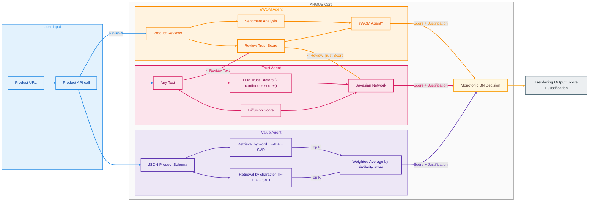
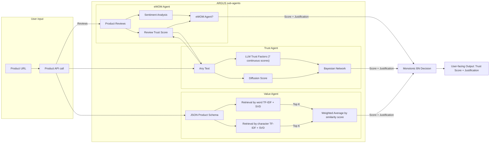
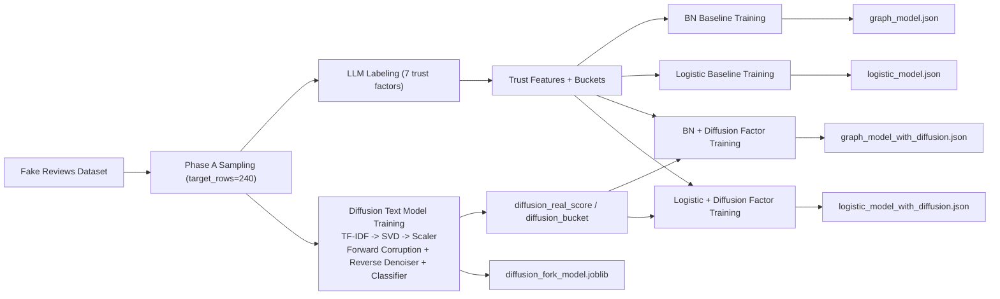
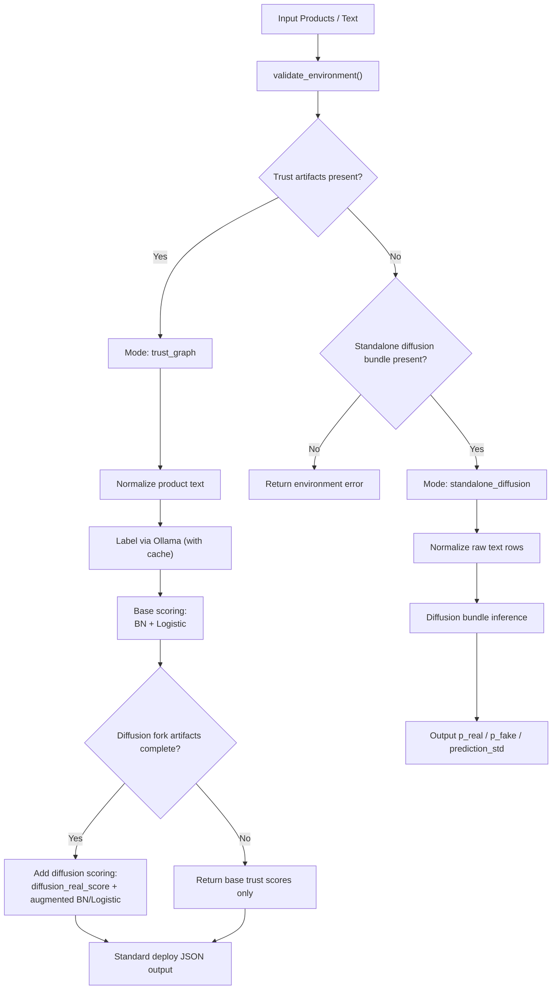
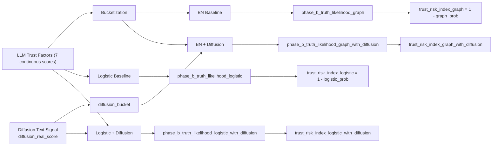
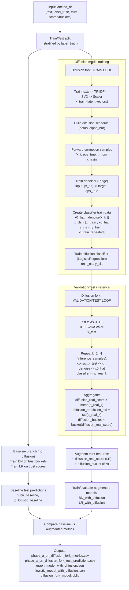

# Trust Graph + Diffusion Pipeline Diagrams

## 1) Training and Artifact Build Flow

## 2) Deploy Runtime Mode Selection and Inference

## 3) Scoring Composition (Before vs After Diffusion Fork)

