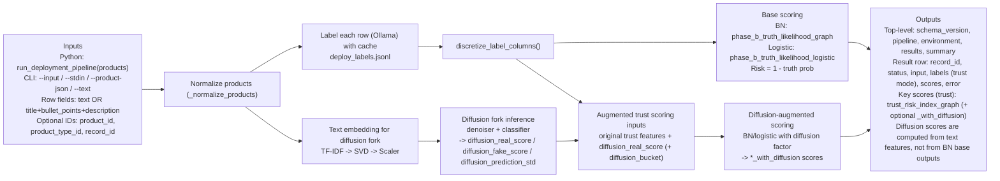

# Trust Fake Reviews Plus Detection

This experiment mirrors `experiment_trust_fake_reviews` and adds a diffusion fork into Phase A modeling and deploy-time inference.

## Tracks

- Replica trust graph track:
  - [`experiment_llm_trust_graph_plus_detection.ipynb`](/Users/lohzh/Desktop/cs3263-repo/experiment_trust_fake_reviews_plus_detection/experiment_llm_trust_graph_plus_detection.ipynb)
  - [`llm_trust_graph_pipeline.py`](/Users/lohzh/Desktop/cs3263-repo/experiment_trust_fake_reviews_plus_detection/llm_trust_graph_pipeline.py)
  - [`bn_diffusion_fork.py`](/Users/lohzh/Desktop/cs3263-repo/experiment_trust_fake_reviews_plus_detection/bn_diffusion_fork.py)
- Standalone diffusion detector track:
  - [`experiment_diffusion_plus_detection.ipynb`](/Users/lohzh/Desktop/cs3263-repo/experiment_trust_fake_reviews_plus_detection/experiment_diffusion_plus_detection.ipynb)
  - [`diffusion_detection_pipeline.py`](/Users/lohzh/Desktop/cs3263-repo/experiment_trust_fake_reviews_plus_detection/diffusion_detection_pipeline.py)

Deploy runtime:

- [`deploy_pipeline.py`](/Users/lohzh/Desktop/cs3263-repo/experiment_trust_fake_reviews_plus_detection/deploy_pipeline.py)

## Dev Shortcut

Minimal case:

```python
from experiment_trust_fake_reviews_plus_detection import run_deployment_pipeline

result = run_deployment_pipeline(
    [
        {
            "product_id": "demo-1",
            "title": "USB-C Hub",
            "bullet_points": "4K HDMI; USB 3.0; PD passthrough",
            "description": "Six-port aluminium hub.",
        }
    ]
)

row = result["results"][0]
base_key_score = row["scores"]["trust_risk_index_graph"]
diffusion_key_score = row["scores"].get("trust_risk_index_graph_with_diffusion")
print(base_key_score, diffusion_key_score)
```

Use this first:

- `trust_risk_index_graph`: main deploy risk score. Higher means more trust risk.

If diffusion fork artifacts are present, also use:

- `trust_risk_index_graph_with_diffusion`: diffusion-augmented risk score.

Import update from old experiment:

- old: `from experiment_trust_fake_reviews import run_deployment_pipeline`
- new: `from experiment_trust_fake_reviews_plus_detection import run_deployment_pipeline`

## Notebook Expectations

Replica notebook keeps the same Phase A defaults as `experiment_trust_fake_reviews`:

- `phase_a_target_rows = 240`
- `test_size = 0.25`
- `random_state = 42`

Additional final cell:

- `Additional Eval: BN before vs after diffusion-factor fork`

This cell now also writes deploy artifacts for diffusion-aware trust inference:

- `graph_model_with_diffusion.json`
- `logistic_model_with_diffusion.json`
- `diffusion_fork_model.joblib`
- plus eval tables:
  - `phase_a_bn_diffusion_fork_metrics.csv`
  - `phase_a_bn_diffusion_fork_test_predictions.csv`

Base deploy artifacts written by notebook:

- `graph_model.json`
- `logistic_model.json`

## Deploy Modes

`deploy_pipeline.py` auto-selects mode based on available artifacts.

1. `trust_graph` mode (preferred)
- requires `graph_model.json` and `logistic_model.json`
- uses Ollama labels + BN/logistic scoring
- if diffusion fork artifacts exist, also outputs diffusion-aware trust scores

2. `standalone_diffusion` fallback mode
- used when trust artifacts are missing but `diffusion_model_bundle.joblib` exists
- scores raw text directly with diffusion detector

## Deploy Pipeline I/O Diagram



## Trust Deploy Scores

Base (always in trust mode):

- `phase_b_truth_likelihood_graph`
- `phase_b_truth_likelihood_logistic`
- `trust_risk_index_graph`
- `trust_risk_index_logistic`
- `graph_uncertainty_entropy`

Diffusion-augmented (when fork artifacts present):

- `diffusion_real_score`
- `diffusion_fake_score`
- `diffusion_prediction_std`
- `phase_b_truth_likelihood_graph_with_diffusion`
- `phase_b_truth_likelihood_logistic_with_diffusion`
- `trust_risk_index_graph_with_diffusion`
- `trust_risk_index_logistic_with_diffusion`

## CLI

Environment check:

```bash
python -m experiment_trust_fake_reviews_plus_detection.deploy_pipeline --check-env
```

Trust deploy run:

```bash
python -m experiment_trust_fake_reviews_plus_detection.deploy_pipeline \
  --input /path/to/products.json \
  --output /path/to/results.json
```

Standalone diffusion fallback quick run:

```bash
python -m experiment_trust_fake_reviews_plus_detection.deploy_pipeline \
  --artifacts-dir /path/to/diffusion/artifacts \
  --text "Excellent quality and exactly as described." \
  --text "Limited stock miracle product buy now"
```

## Notes

- If notebook/deploy are run from a different Python environment than training, sklearn model deserialization can fail due to version mismatch. Use the same project venv for training and deploy.
