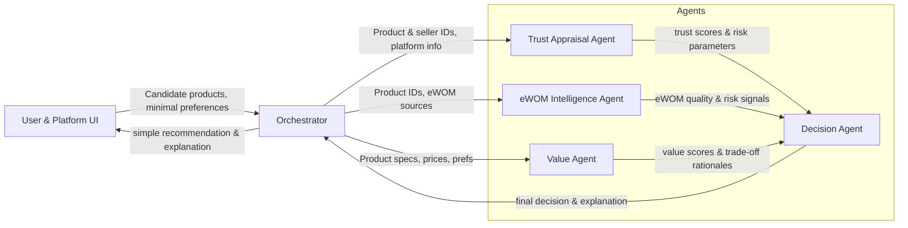

# Project Architecture: Multi‑Agent System for Online Product Comparison

## 1. Context and Objectives

### 1.1 Problem setting

The system targets **ecommerce, non‑luxury goods** (e.g., mid‑range electronics, everyday home appliances) under the following assumptions:

- The **user already intends to purchase** a product in a given category.  
- The user is **willing to use the current platform and listed sellers** (no need to model platform adoption).  
- The user has **low motivation/ability** to process detailed product information and tends to rely on **heuristics** such as star ratings, popularity, and discounts. [thedecisionlab](https://thedecisionlab.com/reference-guide/philosophy/system-1-and-system-2-thinking)

The system’s purpose is to **support concrete product comparison** (e.g., “Product A vs Product B”) and approximate the **best decision the user could make with full information and System‑2‑style reasoning**, while exposing only low‑effort recommendations.

### 1.2 High‑level design

The system is organized as four agents coordinated by an Orchestrator:

- **Trust Appraisal Agent (T):** Evaluates platform/seller trust and trust‑related risk.  
- **eWOM Intelligence Agent (E):** Interprets electronic word‑of‑mouth (reviews, social content) as information, social influence, and risk signal.  
- **Value Agent (V):** Computes risk‑adjusted perceived value and future‑proofness for each product.  
- **Decision Agent (D):** Integrates trust, eWOM, and value into a final recommendation and concise explanation.

***

## 2. Theoretical Foundations

### 2.1 Trust and eWOM in social commerce

**Core source:** Di Virgilio & Antonelli, *Consumer Behavior, Trust, and Electronic Word‑of‑Mouth Communication: Developing an Online Purchase Intention Model*. 

- Extends the **Theory of Planned Behavior (TPB)** by adding **trust in social media platforms** and **eWOM communication** as mediators of online purchase intention. 
- Defines **trust** as belief that one can rely on a partner to act in line with expectations, especially under uncertainty. 
- Decomposes platform trust into **competence, benevolence, integrity, predictability**. 
- Defines **eWOM** as online exchange of product/service evaluations that:  
  - Provides **additional, highly customized information**. 
  - Measures **popularity and inclination** toward brands. 
  - **Reduces risk, uncertainty, and ambiguity** in purchase decisions. 

Related social‑commerce research:

- **eWOM → trust → purchase intention:** eWOM credibility and quality significantly increase **trust** and **purchase intention** in SNS and social commerce. [pmc.ncbi.nlm.nih](https://pmc.ncbi.nlm.nih.gov/articles/PMC11176835/)
- **Trust and perceived risk** jointly shape online purchase intention on social commerce platforms. [frontiersin](https://www.frontiersin.org/journals/psychology/articles/10.3389/fpsyg.2020.00890/full)

**Design consequence:**  
We treat **trust** and **eWOM** as **social‑cognitive inputs** that:

- Calibrate **risk** (platform, seller, product).  
- Shape the **credibility and weight** of information the user sees.  
- Become inputs to economic evaluation and final choice.

***

### 2.2 Perceived value, value‑for‑money, and future‑proofness

Perceived value is a central construct in consumer behaviour:

- Value is defined as the consumer’s **overall assessment of utility based on what is received and what is given** (quality/benefits vs price, effort, and risk). [worldresearchlibrary](https://www.worldresearchlibrary.org/up_proc/pdf/851-150003474061-65.pdf)
- Work on durables decomposes perceived value into **functional, emotional, social, and monetary** components; **functional and monetary value** dominate for non‑luxury durable goods. [ijream](http://ijream.org/papers/IJREAMV04I0339135.pdf)
- Online shopping studies find **perceived value and trust** both significantly influence purchase intention. [ejournal.uin-malang.ac](https://ejournal.uin-malang.ac.id/index.php/mec/article/view/4856)

The system aims to operationalize:

- **Value‑for‑money**: trade‑off between functional performance, quality, and total cost (price + expected hassles/repairs).  
- **Future‑proofness**: expected usable lifetime, compatibility, and support; key for electronics and appliances.

We embed this in a **multi‑attribute evaluation** framework:

- Consumer research on trade‑offs shows that people compare products by allowing improvements on one attribute to compensate for declines on another (compensatory rules). [faculty.wharton.upenn](https://faculty.wharton.upenn.edu/wp-content/uploads/2015/07/1994---tradeoffs-depend-on-attribute-range.pdf)
- Trade‑offs depend on attribute ranges; larger differences make attributes more influential in comparison. [faculty.wharton.upenn](https://faculty.wharton.upenn.edu/wp-content/uploads/2015/07/1994---tradeoffs-depend-on-attribute-range.pdf)
- Multi‑attribute benefits‑based models show that attributes → perceived benefits → choice, and that multiple benefits mediate the effect of attributes. [journals.sagepub](https://journals.sagepub.com/doi/10.1177/0022243719881618)

**Design consequence:**  
The **Value Agent** uses a **multi‑attribute, compensatory decision model** to compare products on:

- Functional benefits.  
- Monetary sacrifice.  
- Risk‑adjusted lifetime.  
- Future‑proofness.

Trust/eWOM‑derived risk is integrated into the “what is given” side of perceived value.

***

### 2.3 Comparison‑specific consumer behaviour

You care specifically about decisions **between concrete alternatives** (e.g., Product A vs Product B).

Relevant research:

- **Attribute–task compatibility & alignability:**  
  - In joint evaluation (side‑by‑side comparison), consumers overweight **alignable attributes** (same dimension, easily compared) and may underweight unique features. [journals.sagepub](https://journals.sagepub.com/doi/10.1177/002224379703400202)
- **Attentional models of choice:**  
  - The multi‑attribute attentional drift‑diffusion model shows that **attributes receiving more attention are given more weight** in choice; attention can change the relative influence of attributes. [publications.dyson.cornell](http://publications.dyson.cornell.edu/research/doc/maDDM.Fisher.pdf)

**Design consequence:**

- The system must ensure **critical attributes** (risk, expected lifetime, key functional metrics) are **alignable and salient** when presenting comparisons.  
- The **Decision Agent** controls which attributes are foregrounded to avoid re‑creating user heuristics (e.g., price + rating only).

***

### 2.4 Dual‑process / System‑1 vs System‑2 framing

Dual‑process theories and the **Heuristic‑Systematic Model (HSM)**: [en.wikipedia](https://en.wikipedia.org/wiki/Heuristic-systematic_model_of_information_processing)

- System 1 / heuristic processing: fast, effortless, driven by simple cues (ratings, popularity, discounts).  
- System 2 / systematic processing: effortful, analytic, integrating multiple attributes.  

In low motivation/ability contexts, consumers default to System 1; high involvement and resources lead to System 2. [en.wikipedia](https://en.wikipedia.org/wiki/Elaboration_likelihood_model)

**Design stance:**

- The system acts as **System‑2‑for‑the‑user**: internally performs systematic, multi‑attribute analysis but outputs **simple, heuristic‑compatible recommendations**.  

***

## 3. System Architecture

### 3.1 Overall flow

- The **User & Platform UI** provides:  
  - A small set of **candidate products** (e.g., 2–5 items in a comparison view).  
  - **Minimal preferences/constraints** (budget, one or two “must‑have” attributes).  

- The **Orchestrator**:  
  - Dispatches product & seller IDs and platform metadata to the Trust Agent.  
  - Sends product IDs and eWOM sources to the eWOM Agent.  
  - Sends product specs, prices, and user preferences to the Value Agent.  
  - Receives outputs from all agents; passes them to the Decision Agent.  
  - Delivers the Decision Agent’s final decision back as a **small, actionable recommendation**.

***

## 4. Agent Designs

### 4.1 Trust Appraisal Agent (T)

**Purpose:** Quantify platform/seller **trust** and **trust‑related risk** for each candidate product.

**Theoretical basis:**

- Di Virgilio & Antonelli: trust in social media platforms as competence, benevolence, integrity, predictability. 
- Online trust and perceived risk as determinants of purchase intention. [ijsrm](https://ijsrm.net/index.php/ijsrm/article/view/6545)

**Inputs:**

- Platform data:  
  - Purchase protection policies, refund/return conditions, dispute resolution mechanisms.  
  - Security/privacy features and certifications.

- Seller data per product:  
  - Seller rating and history.  
  - Return rates, cancellation rates, dispute statistics.  
  - Tenure and volume.

- eWOM Agent signals:  
  - Whether reviews corroborate or contradict the official picture (e.g., many complaints about mishandled refunds).

**Internal constructs:**

For each (platform, seller):

- **Competence (T_comp):**  
  Perceived capability to ensure successful transactions and correct failures. 
  - Indicators: on‑time delivery rate, successful resolution of disputes, refund execution reliability.

- **Benevolence (T_benev):**  
  Perceived willingness to act in users’ interest beyond narrow profit. 
  - Indicators: policy leniency in borderline cases, reputation for fairness, absence of systematic “nickel‑and‑diming”.

- **Integrity (T_integr):**  
  Perceived adherence to ethical behavior and promise‑keeping. 
  - Indicators: transparency of fees, accuracy of listing information, alignment between policies and actual practice.

- **Predictability (T_pred):**  
  Perceived consistency of behaviour over time. 
  - Indicators: stability of ratings, absence of sudden quality drops, low variance in user experiences.

**Outputs:**

- **Trust vector** per seller/platform:  
  \[
  \text{Trust} = (T_{\text{comp}}, T_{\text{benev}}, T_{\text{integr}}, T_{\text{pred}})
  \]
- **Aggregated trust score** (e.g., weighted average).  
- **Trust‑related risk parameter**, such as estimated probability of transaction problems.

**How T supports D and V:**

- **To Decision Agent (D):**  
  - Supplies trust scores and risk parameters, used to:  
    - Filter out low‑trust sellers.  
    - Use trust as a tie‑breaker between products with similar value.

- **To Value Agent (V):**  
  - Provides trust‑related risk, influencing expected costs (more likely returns/hassles).

***

### 4.2 eWOM Intelligence Agent (E)

**Purpose:** Transform reviews/social content into **information quality**, **credibility**, and **product risk** signals.

**Theoretical basis:**

- Di Virgilio & Antonelli: eWOM as customized information that reduces risk and signals popularity. 
- eWOM credibility, quality, and information usefulness as drivers of trust and purchase intention. [jurnal.untan.ac](https://jurnal.untan.ac.id/index.php/JJ/article/view/50594/0)
- Visual eWOM and social proof effects. [pmc.ncbi.nlm.nih](https://pmc.ncbi.nlm.nih.gov/articles/PMC12244485/)

**Inputs:**

- On‑platform reviews: ratings, text, timestamps, reviewer metadata.  
- Off‑platform mentions (if accessible): forum threads, social posts, blogs.  
- Engagement signals: helpfulness votes, responses, likes.

**Internal constructs:**

For each product:

1. **Information richness (Q_info):**  
   Extent to which eWOM contains specific, diagnostic details (usage context, comparisons, concrete problems) rather than generic praise. 

2. **Credibility (Q_cred):**  
   Believability and authenticity of eWOM:  
   - Consistency across reviewers.  
   - Presence of long, detailed reviews vs short/generic ones.  
   - Suspicious patterns suggestive of astroturfing.

3. **Consensus and variance:**  
   - Overall sentiment/average rating.  
   - Variance in ratings and experiences; high variance often signals hidden risk.

4. **Risk and durability signals:**  
   - Frequency, severity, and timing of complaints about defects, misrepresentation, logistics, or support failures. 
   - Temporal pattern (e.g., many “died after 6 months” posts).

**Outputs:**

- **eWOM quality vector** per product:  
  \[
  Q_{\text{eWOM}} = (Q_{\text{info}}, Q_{\text{cred}}, Q_{\text{consensus}}, Q_{\text{var}})
  \]
- **Product risk profile:**  
  - Estimated probabilities for early failure, mismatch with description, logistics problems.  
- **Trust support signals:**  
  - Flags where eWOM either reinforces or undermines perceived platform/seller trust (e.g., many complaints about denied refunds).

**How E supports D and V:**

- **To Decision Agent (D):**  
  - Provides summarized **eWOM quality** and **risk signals** for comparative reasoning.  

- **To Value Agent (V):**  
  - Supplies **risk parameters** for expected lifetime and hassle costs.  

- **To Trust Agent (T):**  
  - Adds context on how actual user experiences align with platform/seller promises.

***

### 4.3 Value Agent (V)

**Purpose:** Compute risk‑adjusted perceived value and future‑proofness for each product, enabling **rational A vs B comparisons**.

**Theoretical basis:**

- Perceived value as benefits vs sacrifices (quality, benefits vs price, risk). [jcsdcb](https://www.jcsdcb.com/index.php/JCSDCB/article/view/7/214)
- Perceived value and trust jointly drive online purchase intention. [ijream](http://ijream.org/papers/IJREAMV04I0339135.pdf)
- Multi‑attribute trade‑off models and benefits‑based choice. [xmgc](https://www.xmgc.org/topic/compensatory-and-non-compensatory-decision-rules-in-consumer-behavior)

**Inputs:**

- Product specs and attributes:  
  - Functional (performance, capacity, speed, feature set).  
  - Warranty length and coverage.  
  - Compatibility and ecosystem (standards, ports, software support).

- Economic data:  
  - Price.  
  - Ownership costs (consumables, accessories, energy).

- User preferences/constraints:  
  - Budget.  
  - One or two must‑have attributes or minimum thresholds (e.g., storage ≥ X).

- Trust Agent outputs:  
  - Trust score and trust‑related risk.

- eWOM Agent outputs:  
  - Product‑specific risk profile (failure rates, durability issues).

**Internal constructs:**

1. **Functional utility (U_func):**  
   - Map specs to performance vs user need (e.g., “enough for typical browsing and coding”).  
   - Quantify how well each product satisfies core tasks.

2. **Future‑proofness (U_future):**  
   - Expected usable lifetime, based on category norms and eWOM signals.  
   - Compatibility and support horizon.

3. **Cost (C):**  
   - Upfront price.  
   - Expected additional costs (e.g., typical repair, accessories, energy).

4. **Risk‑adjusted expected lifetime:**  
   - Combine baseline lifetime with eWOM‑derived failure probabilities and trust‑related risk (likelihood of non‑support, difficulties using warranty).

**Value model (conceptual):**

For each product \(i\):

- Compute total utility:  
  \[
  U_i = w_{\text{func}} \cdot U_{\text{func}, i} + w_{\text{future}} \cdot U_{\text{future}, i}
  \]
- Compute risk‑adjusted cost:  
  \[
  C_i = \text{price}_i + \text{expected\_risk\_cost}_i
  \]
  where expected risk cost is derived from failure probabilities, likely repairs, and hassle (trust).  

- Perceived value:  
  \[
  PV_i = \frac{U_i}{C_i}
  \]

**Outputs:**

- **Value vector** per product:  
  \[
  V_i = (U_{\text{func}, i}, U_{\text{future}, i}, C_i, PV_i)
  \]
- **Trade‑off rationale**:  
  - Short textual summary of the main trade‑offs vs competing products (e.g., “10% cheaper, slightly lower performance, significantly higher early failure risk”).  

**How V supports D:**

- **To Decision Agent (D):**  
  - Provides comparable **value scores** for each product.  
  - Supplies structured **trade‑off explanations** to be selectively shown to the user.

***

### 4.4 Decision Agent (D)

**Purpose:** Integrate trust, eWOM, and value information to output a **final choice recommendation and user‑facing explanation**, with a strong focus on **two‑product (or small set) comparison**.

**Theoretical basis:**

- Multi‑attribute comparison and trade‑offs. [journals.sagepub](https://journals.sagepub.com/doi/10.1177/0022243719881618)
- Attribute‑task compatibility and alignability in joint evaluation. [onlinelibrary.wiley](https://onlinelibrary.wiley.com/doi/abs/10.1002/cb.1962)
- Dual‑process theories: System‑2 integration of multiple cues, packaged for System‑1 consumption. [thedecisionlab](https://thedecisionlab.com/reference-guide/philosophy/system-1-and-system-2-thinking)

**Inputs:**

- From Trust Agent (T):  
  - Trust vectors and aggregated trust scores for each product’s seller/platform.  
  - Trust‑related risk estimates.

- From eWOM Agent (E):  
  - eWOM quality vectors.  
  - Product risk profiles.  

- From Value Agent (V):  
  - Value vectors and perceived value scores.  
  - Trade‑off rationales.

**Internal logic:**

1. **Filtering and minimum thresholds:**

   - Exclude products associated with **very low trust** or **extreme risk**, regardless of value.  
   - Enforce user’s hard constraints (budget, must‑have attributes).

2. **Ranking and comparison:**

   - Primary ranking by **perceived value score** \(PV_i\).  
   - If two products are close in value, use **trust** and **risk** as tiebreakers.  
   - Make sure comparisons are based on **alignable attributes**: price, key performance metrics, risk‑adjusted lifetime, and trust level. [journals.sagepub](https://journals.sagepub.com/doi/10.1177/002224379703400202)

3. **Explanation construction:**

   - Identify the **top recommended product**.  
   - Construct a concise comparison explanation focusing on:  
     - Value‑for‑money difference.  
     - Key risk differences from eWOM.  
     - Any notable trust differences.  
   - Example:  
     - “Product A has higher expected reliability and longer support, and offers better value‑for‑money overall despite being slightly more expensive than Product B.”

**Outputs:**

- **Final decision:**  
  - Single recommended product ID (for 2‑product or small‑set comparison).  
  - Optional ranked list for UI.

- **User‑facing explanation:**  
  - 1–3 short sentences, System‑1 friendly, covering:  
    - Why the recommended product is better on value‑for‑money.  
    - Any major trust or risk issues in the non‑recommended alternative.  
    - Minimal technical detail.

***

## 5. Assumptions and Design Choices

- **Fixed intention and platform acceptance:**  
  We do not model whether the user will buy at all, nor whether they trust the platform enough to start; we assume they are already on the product page ready to choose between alternatives.

- **Non‑luxury focus:**  
  Emphasis on **functional and monetary value** and **risk/future‑proofness**; affective and identity‑expressive aspects are de‑emphasized.

- **System‑2 internal, System‑1 external:**  
  Internals follow systematic, multi‑attribute and socially grounded reasoning; UI outputs are **short, actionable, and heuristic‑compatible**.

- **Comparison context:**  
  The system is designed primarily for **small‑set comparison** (2–5 products) where trade‑offs and side‑by‑side presentation matter.

***

If you’d like, we can next define a concrete JSON‑style schema for the messages between V and D (e.g., the exact fields in the `value scores & trade‑off rationales` payload) to make implementation straightforward.