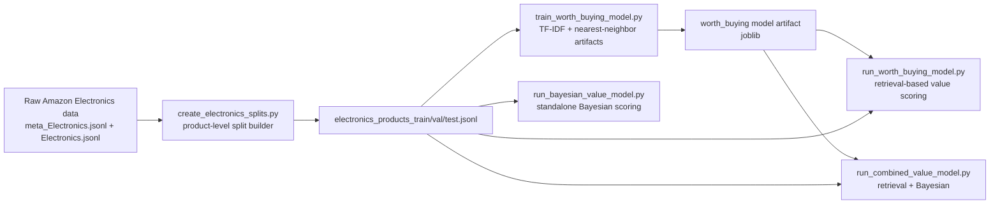
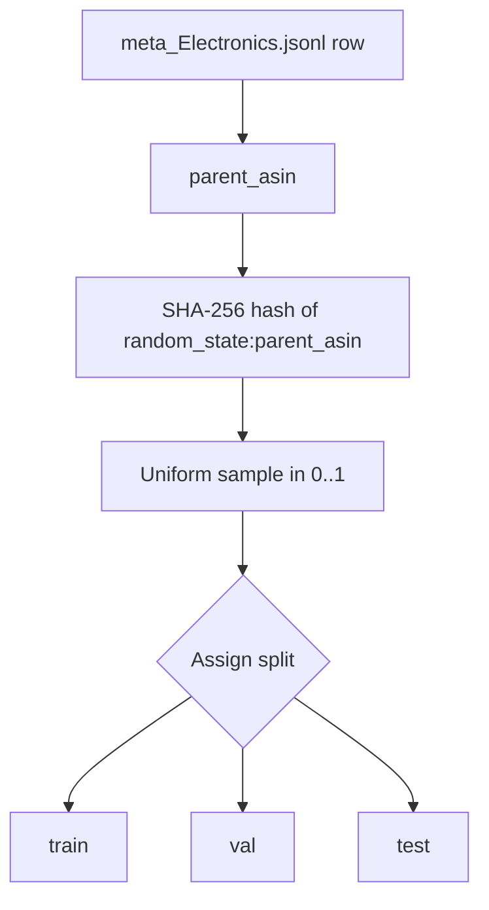
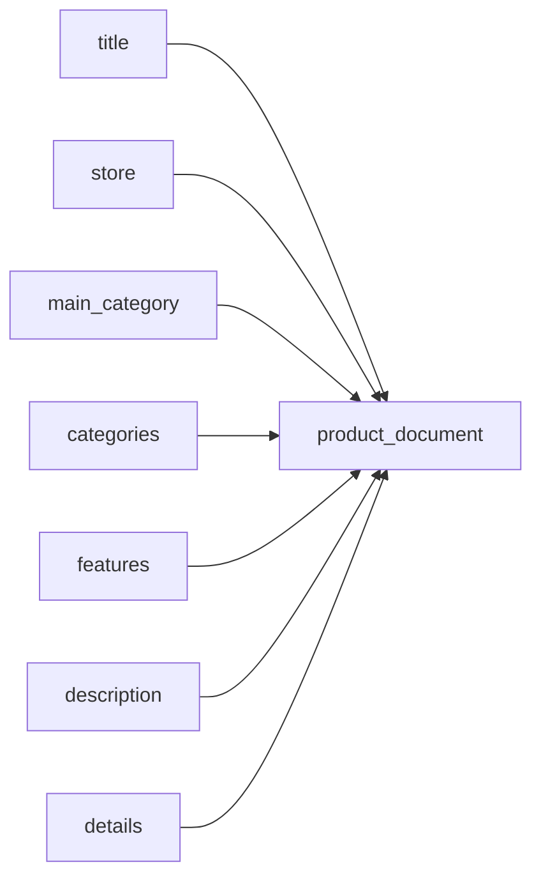
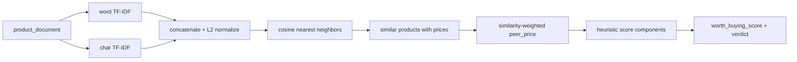
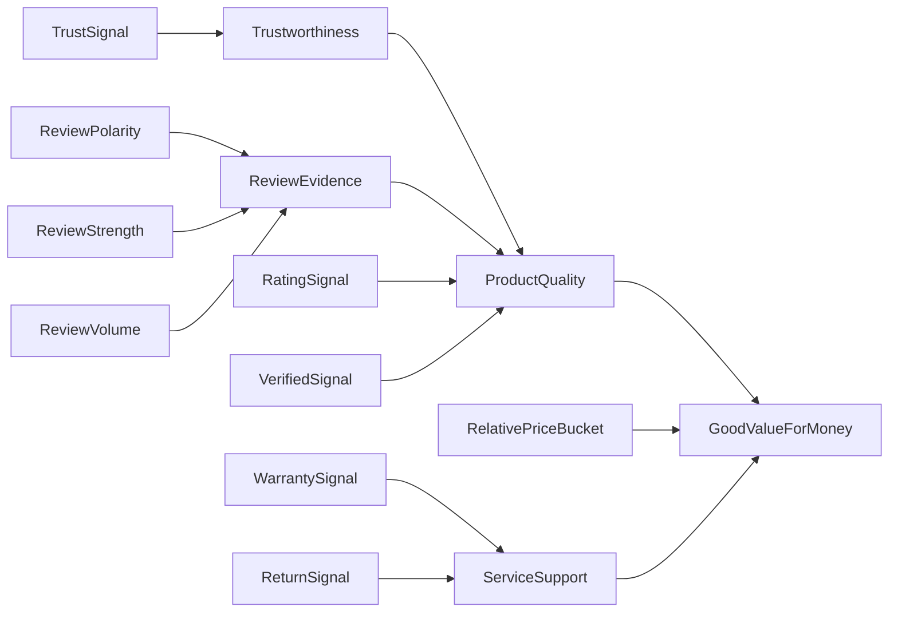
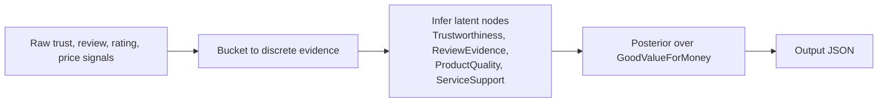
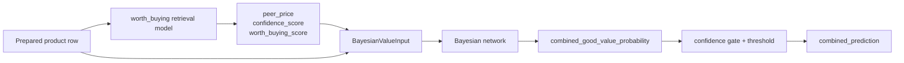

# Value Agent

This package now contains three distinct value-scoring paths plus one shared
dataset-preparation workflow:

- a legacy deterministic two-listing comparator for `listing_a` vs `listing_b`
- a retrieval-based `worth_buying` scorer that learns a product-neighbor index
- a hand-authored Bayesian value model that outputs a calibrated probability
- a combined pipeline that uses retrieval for market context and Bayesian
  inference for the final `good value` prediction

If you are working with the Amazon Electronics dataset in this repo, the most
complete end-to-end path is the combined pipeline:

1. build product-level train/validation/test splits from the raw Amazon files
2. train the retrieval-based `worth_buying` model on the train split
3. run the combined pipeline on validation or test so the retrieval model
   supplies `peer_price` and confidence, and the Bayesian model supplies the
   final probability

## Methods At A Glance

| Component | Nature | Trained? | Input shape | Output |
| --- | --- | --- | --- | --- |
| `compare_listings` | deterministic rule-based comparator | no | 2 listings | `better_A`, `better_B`, `tie`, or `insufficient_evidence` |
| `worth_buying` | retrieval + heuristic scoring | yes, vectorizers and nearest-neighbor index | 1 product row | `peer_price`, `worth_buying_score`, `confidence_score`, verdict |
| Bayesian value model | discrete Bayesian network | no, CPTs are hand-authored | 1 product row with trust/review/price signals | `good_value_probability` |
| combined pipeline | chained retrieval + Bayesian inference | partially, retrieval layer only | 1 product row | `combined_good_value_probability`, `combined_prediction` |

## Repository Architecture



## Which Path Should You Use?

- Use the deterministic comparator when you want to compare exactly two seller
  listings and need a simple auditable rule-based answer.
- Use the standalone Bayesian model when you already have trust/review signals
  and a known `peer_price` and want a probability.
- Use the `worth_buying` model when you need the repo to infer `peer_price`
  automatically from similar products.
- Use the combined model when you want both: learned market context from
  retrieval plus a final Bayesian `good value` probability.

## 1. Legacy Deterministic Comparator

This is the original `compare_listings(...)` path. It compares two specific
listings using fixed weights over cost, spec compatibility, and service terms.

### Design Rules

- compare exactly two listings
- depend only on listing/value fields
- stay deterministic for reproducibility and auditability
- return `insufficient_evidence` instead of forcing a guess

### Scoring Rubric

- `cost` weight: `0.60`
- `spec` weight: `0.25`
- `service` weight: `0.15`

Final scores:

```text
value_score_a = 0.60*cost_a + 0.25*spec_a + 0.15*service_a
value_score_b = 0.60*cost_b + 0.25*spec_b + 0.15*service_b
```

Verdict policy:

- `insufficient_evidence` if `confidence < 0.45`
- `tie` if `|value_score_a - value_score_b| <= 3.0`
- else `better_A` or `better_B`

### Confidence Policy

Confidence starts at `1.0` and is reduced by:

- missing fields
- estimated total price
- low title/spec comparability
- currency mismatch
- low required-spec coverage

### CLI

```bash
python -m value.cli --mock --pretty
python -m value.cli --input ./sample_payload.json --pretty
```

## 2. Electronics Dataset Preparation

The Amazon Electronics workflow begins with the split builder in
`value/create_electronics_splits.py`.

### Source Files

- `data/raw/amazon-product-data/dataset/meta_Electronics.jsonl`
- `data/raw/amazon-product-data/dataset/Electronics.jsonl`

### Output Files

- `data/value/electronics_split/electronics_products_train.jsonl`
- `data/value/electronics_split/electronics_products_val.jsonl`
- `data/value/electronics_split/electronics_products_test.jsonl`
- `data/value/electronics_split/split_summary.json`

Each output row is a single product keyed by `parent_asin`, not a single review.

### Why Product-Level Splits?

The retrieval model scores products, not individual reviews. We therefore need a
compact product catalog where each row contains:

- catalog metadata such as title, store, categories, features, description
- product-level price and aggregate rating signals from `meta_Electronics.jsonl`
- review-derived weak signals aggregated from `Electronics.jsonl`

### Split Strategy

Splitting is deterministic by `parent_asin`, not random by row. The builder hashes
`random_state:parent_asin` with `SHA-256` and maps the resulting sample to:

- `test` if `sample < test_ratio`
- `val` if `sample < test_ratio + validation_ratio`
- otherwise `train`

This guarantees that a product remains entirely in one split across repeated runs.



### Review Aggregation

For each `parent_asin`, the builder scans reviews and accumulates:

- `review_count`
- `verified_count`
- `helpful_vote_total`
- `rating_sum`

These are turned into the following weak signals:

```text
verified_purchase_rate = verified_count / review_count
avg_review_rating = rating_sum / review_count
helpful_vote_avg = helpful_vote_total / review_count

review_volume_signal = 1 - exp(-review_count / 50)
trust_probability = clamp(0.70*verified_purchase_rate + 0.30*review_volume_signal, 0, 1)

ewom_score_0_to_100 = clamp(((avg_review_rating - 1) / 4) * 100, 0, 100)

helpful_signal = 1 - exp(-helpful_vote_avg / 2)
ewom_magnitude_0_to_100 =
    clamp(100 * (0.70*review_volume_signal + 0.30*helpful_signal), 0, 100)
```

These are not learned targets. They are weakly constructed proxy signals meant to
feed the later models.

### Product Document Construction

The retrieval model uses a text field named `product_document`, built by
concatenating:

- title
- store
- main category
- categories
- features
- description
- flattened key-value metadata details

The split builder now also emits a coarse `listing_kind` label for retrieval
filtering. Current values are:

- `device`
- `case`
- `cable`
- `charger`
- `tips`
- `cleaning`
- `accessory`
- `other`



### Build Commands

```bash
python -m value.create_electronics_splits \
  --meta-path data/raw/amazon-product-data/dataset/meta_Electronics.jsonl \
  --review-path data/raw/amazon-product-data/dataset/Electronics.jsonl \
  --output-dir data/value/electronics_split
```

Useful flags:

- `--validation-ratio 0.10`
- `--test-ratio 0.10`
- `--max-meta-rows N`
- `--max-review-rows N`

## 3. Retrieval-Based Worth-Buying Model

The `worth_buying` model is not a classic supervised classifier. It is closer to
retrieval-assisted scoring:

1. represent products as TF-IDF vectors
2. retrieve similar priced products
3. estimate a similarity-weighted `peer_price`
4. combine price alignment, rating quality, review quality, and confidence into a
   final `worth_buying_score`

### What Is Actually Trained?

Training fits and saves:

- a word-level `TfidfVectorizer`
- a character-level `TfidfVectorizer`
- a brute-force cosine `NearestNeighbors` index over the train catalog

No supervised label is fitted in the current implementation. The learned portion
is the retrieval representation, not the final scoring equation.

### Feature Representation

Two TF-IDF views are learned from `product_document`:

- word analyzer: `ngram_range=(1, 2)`, `stop_words='english'`
- character analyzer: `char_wb`, `ngram_range=(3, 5)`

The two sparse matrices are concatenated and L2-normalized.

### Neighbor Retrieval

At inference time, the model:

1. transforms the query product into the same TF-IDF space
2. retrieves candidate nearest neighbors using cosine distance
3. excludes the same `parent_asin`
4. excludes candidates without a known price
5. keeps only neighbors with similarity `>= min_similarity`
6. keeps up to `top_k_neighbors`

`peer_price` is then the similarity-weighted average of the neighbor prices:

```text
peer_price = weighted_average(neighbor_price_i, weight=similarity_i)
```

### Retrieval Model Diagram



### Score Components

#### Price Alignment

```text
relative_gap = (peer_price - price) / peer_price
price_alignment_score = clamp(0.5 * (1 + tanh(relative_gap / price_score_scale)), 0, 1)
```

Interpretation:

- above `0.5` means the item is cheaper than similar products
- below `0.5` means it is pricier than similar products

#### Bayesian-Smoothed Product Rating

The model smooths product rating with a global prior:

```text
posterior_rating =
    (bayesian_rating_prior_weight * global_rating_mean + rating_number * average_rating) /
    (bayesian_rating_prior_weight + rating_number)

bayesian_rating_score = clamp(posterior_rating / 5, 0, 1)
```

This helps avoid over-trusting products with tiny rating counts.

#### Review Quality Score

```text
rating_score = clamp(avg_review_rating_or_fallback / 5, 0, 1)
verified_score = clamp(verified_purchase_rate, 0, 1)
helpful_score = 1 - exp(-helpful_vote_total / helpful_vote_scale)
volume_score = 1 - exp(-review_count / review_volume_scale)

review_quality_score =
    clamp(
        0.45*rating_score +
        0.25*verified_score +
        0.15*helpful_score +
        0.15*volume_score,
        0,
        1
    )
```

#### Confidence Score

```text
neighbor_coverage = clamp(neighbor_count / top_k_neighbors, 0, 1)
similarity_score = clamp(average_neighbor_similarity, 0, 1)
volume_score = 1 - exp(-review_count / review_volume_scale)

confidence_score =
    clamp(
        0.45*neighbor_coverage +
        0.35*similarity_score +
        0.20*volume_score,
        0,
        1
    )
```

The config still includes `min_neighbors`, but the current implementation does
not hard-reject a row below that threshold. Instead, low neighbor coverage is
already reflected through `confidence_score`.

#### Final Worth-Buying Score

```text
review_component = 0.55*bayesian_rating_score + 0.45*review_quality_score

low_rating_penalty =
    0                                  if average_rating >= 3.6
    (3.6 - average_rating) * 0.22      otherwise

worth_buying_score =
    clamp(
        0.45*price_alignment_score +
        0.40*review_component +
        0.15*confidence_score -
        low_rating_penalty,
        0,
        1
    )
```

Verdict thresholds:

- `insufficient_evidence` if `confidence_score < 0.35`
- `worth_buying` if `worth_buying_score >= 0.62`
- `consider` if `worth_buying_score >= 0.48`
- else `skip`

### Train And Score Commands

Train:

```bash
python -m value.train_worth_buying_model \
  --train-path data/value/electronics_split/electronics_products_train.jsonl \
  --output-prefix value/artifacts/amazon_worth_buying_electronics_tfidf
```

Score validation:

```bash
python -m value.run_worth_buying_model \
  --model-path value/artifacts/amazon_worth_buying_electronics_tfidf.joblib \
  --input-path data/value/electronics_split/electronics_products_val.jsonl \
  --output-path value/artifacts/amazon_worth_buying_validation_scores.csv
```

### What The Retrieval Model Produces

Each scored row includes:

- `peer_price`
- `price_gap_vs_peer`
- `neighbor_count`
- `average_neighbor_similarity`
- `price_alignment_score`
- `bayesian_rating_score`
- `review_quality_score`
- `confidence_score`
- `worth_buying_score`
- `verdict`

## 4. Bayesian Value Model

The Bayesian model is implemented in `value/bayesian_value.py`. It is a discrete
Bayesian network with hand-authored conditional probability tables.

### What It Tries To Estimate

Target node:

```text
GoodValueForMoney in {no, yes}
```

Returned score:

```text
P(GoodValueForMoney = yes | evidence)
```

### Inputs

- `trust_probability`
- `ewom_score_0_to_100`
- `ewom_magnitude_0_to_100`
- `average_rating`
- `rating_count`
- `verified_purchase_rate`
- `price`
- `peer_price`
- `warranty_months`
- `return_window_days`

### Evidence Bucketing

The model first discretizes continuous inputs:

| Raw input | Bucket rule |
| --- | --- |
| `trust_probability` | `low < 0.40`, `medium < 0.70`, else `high` |
| `ewom_score_0_to_100` | `negative < 42`, `mixed <= 58`, else `positive` |
| `ewom_magnitude_0_to_100` | `weak < 25`, `medium < 60`, else `strong` |
| `average_rating` | `low < 3.6`, `medium < 4.3`, else `high` |
| `rating_count` | `low < 20`, `medium < 200`, else `high` |
| `verified_purchase_rate` | `low < 0.50`, `medium < 0.80`, else `high` |
| `price vs peer_price` | `much_pricier`, `pricier`, `fair`, `cheaper`, `much_cheaper` |
| `warranty_months` | `low <= 0`, `medium <= 12`, else `high` |
| `return_window_days` | `low <= 7`, `medium <= 30`, else `high` |

Relative price is computed as:

```text
price_gap_vs_peer = (peer_price - price) / peer_price
```

Positive values mean the product is cheaper than peers.

### Bayesian Network Structure



### How The CPTs Are Built

The CPTs are not fitted from data. They are generated from hand-set score
functions and then normalized.

#### ReviewEvidence

`ReviewEvidence` combines sentiment polarity, magnitude, and review volume.

```text
score =
    1.0 +
    polarity_score * (0.70 + 0.30*strength_scale) +
    volume_bonus
```

Intuition:

- positive polarity lifts the score
- stronger sentiment magnifies the polarity effect
- larger review volume adds credibility

#### ServiceSupport

`ServiceSupport` blends warranty and returns:

```text
score = 0.55*warranty_ordinal + 0.45*return_ordinal
```

#### ProductQuality

`ProductQuality` is the main latent quality node:

```text
score =
    1.0 +
    0.35*trustworthiness +
    0.40*review_evidence +
    0.50*rating_signal +
    0.15*verified_signal
```

Interpretation:

- average rating carries the strongest direct signal
- review evidence is next
- trustworthiness matters
- verified purchase rate is a smaller but useful correction

#### Final GoodValueForMoney Node

The final node is parameterized as a sigmoid over latent quality, price position,
and service support:

```text
logit =
    -0.10 +
    1.60*quality_weight +
    1.20*price_weight +
    0.40*service_weight

P(yes) = sigmoid(logit)
```

The state weights are:

- `ProductQuality`: `low=-1.2`, `medium=0.0`, `high=1.2`
- `RelativePriceBucket`: `much_pricier=-1.4`, `pricier=-0.7`, `fair=0.0`,
  `cheaper=0.8`, `much_cheaper=1.4`
- `ServiceSupport`: `low=-0.35`, `medium=0.0`, `high=0.35`

This means the model strongly rewards high quality and favorable price position,
and uses service support as a smaller adjustment.

### Inference Method

Inference is exact enumeration over the discrete network, not sampling and not
gradient-based optimization.

For each possible state of `GoodValueForMoney`, the model:

1. sets the query node to that state
2. recursively sums over all hidden variables
3. multiplies the relevant conditional probabilities
4. normalizes the result into a posterior distribution

### Behavior With Missing Inputs

Missing optional inputs are allowed.

- if an input is missing, the corresponding evidence node is left unobserved
- the posterior then falls back to priors and whatever other evidence is present

This is especially relevant for the Amazon Electronics split:

- `warranty_months` and `return_window_days` are not currently present in the
  prepared product rows
- therefore the `ServiceSupport` branch is typically unobserved in the combined
  Electronics workflow and falls back to priors

### Standalone Bayesian Diagram



### Standalone Bayesian Commands

```bash
python -m value.run_bayesian_value_model --mock --pretty
python -m value.run_bayesian_value_model --input ./bayesian_value_input.json --pretty
python -m value.run_bayesian_value_model \
  --mock \
  --ewom-mock-json mock/mock_ewom.json \
  --ewom-mock-case-id listing_feedback_mixed_half_good_half_bad \
  --pretty
```

Returned fields:

- `good_value_probability`
- `posterior`
- `component_posteriors`
- `most_likely_component_states`
- `evidence`
- `derived_metrics`
- `resolved_input`
- `fused_agent_signals` when an eWOM/trust result is fused in

### eBay Live Scoring

If you have eBay API credentials configured via `EBAY_CLIENT_ID`,
`EBAY_CLIENT_SECRET`, and `EBAY_ENVIRONMENT`, the normalization script can now
fetch a live eBay listing, run seller feedback through the eWOM stack, and then
score the result with the Bayesian value model.

Basic run:

```bash
python scripts/run_normalization.py \
  --url "https://www.ebay.com.sg/itm/206158794969" \
  --score-bayesian
```

Compact summary output:

```bash
python scripts/run_normalization.py \
  --url "https://www.ebay.com.sg/itm/206158794969" \
  --score-bayesian \
  --summary
```

Compare two scored listings:

```bash
python scripts/run_normalization.py \
  --url "https://www.ebay.com.sg/itm/206158794969" \
  --url "https://www.ebay.com.sg/itm/197809836976" \
  --score-bayesian \
  --compare \
  --summary
```

Optional peer-price inputs:

```bash
python scripts/run_normalization.py \
  --url "https://www.ebay.com.sg/itm/206158794969" \
  --score-bayesian \
  --peer-price 149.0

python scripts/run_normalization.py \
  --url "https://www.ebay.com.sg/itm/206158794969" \
  --score-bayesian \
  --worth-buying-model-path value/artifacts/amazon_worth_buying_quick.joblib

python scripts/run_normalization.py \
  --url "https://www.ebay.com.sg/itm/206158794969" \
  --score-bayesian \
  --bayesian-network-path value/artifacts/amazon_bayesian_value_electronics.json \
  --worth-buying-model-path value/artifacts/amazon_worth_buying_quick.joblib \
  --use-converted-usd \
  --retrieval-candidate-pool-size 500 \
  --top-k-neighbors 5 \
  --min-peer-price-ratio 0.50 \
  --min-peer-neighbors 3 \
  --summary
```

In that mode, the retriever now pulls a larger raw candidate pool from the
Electronics catalog, reranks the pool with stricter product-family checks, and
then estimates `peer_price` from the final top matches. If the remaining
neighbors are too thin, or if the inferred peer price is below the configured
`--min-peer-price-ratio` cutoff, the bridge drops `peer_price` and the Bayesian
model falls back to the no-peer-price path. Use `--min-peer-neighbors` to
require a minimum number of accepted reranked matches before price evidence is
trusted. Use `--use-converted-usd` when you want the eBay side to prefer
eBay-provided USD conversions (`convertedFromValue`) instead of the localized
marketplace currency.

To inspect how retrieval behaves across different `k` values and generate a
graph:

```bash
python scripts/run_normalization.py \
  --url "https://www.ebay.com.sg/itm/206158794969" \
  --score-bayesian \
  --worth-buying-model-path value/artifacts/amazon_worth_buying_quick.joblib \
  --k-values 1,3,5,10,20 \
  --summary
```

In scoring mode, the output includes:

- normalized eBay `candidate` data
- optional retrieval-side `market_context` with inferred `peer_price`
- optional `ewom_result` from seller feedback texts
- final `bayesian_result`
- a retrieval-aware final prediction that can return `insufficient_evidence`
  when price context is missing or too weak, even if the raw Bayesian
  probability is still computed for debugging

With `--k-values`, the command also writes an HTML plot under
`value/artifacts/` unless you override the path with `--k-sweep-output`.

## 5. Combined Retrieval + Bayesian Pipeline

This is the current best end-to-end workflow for the Amazon Electronics data in
this repo.

### Why Combine The Models?

The two models solve different parts of the problem:

- retrieval is good at finding a market baseline and estimating `peer_price`
- Bayesian inference is good at turning trust, review, rating, and price signals
  into an interpretable probability

Used together:

- the retrieval model supplies market context and confidence
- the Bayesian model supplies the final `good value` probability

### Combined Pipeline Logic

For each product row:

1. run retrieval scoring to obtain `peer_price`, `price_gap_vs_peer`,
   `worth_buying_score`, and `confidence_score`
2. build a `BayesianValueInput` from the original row plus retrieval outputs
3. run `score_good_value_probability(...)`
4. convert the probability into a final prediction with a confidence gate

The combined runner uses:

- `price` from the source product row
- `peer_price` from the retrieval model
- `trust_probability`, `ewom_score_0_to_100`, `ewom_magnitude_0_to_100`,
  `average_rating`, and `verified_purchase_rate` from the prepared split row
- `rating_count = rating_number` if present, otherwise `review_count`

### Combined Prediction Rule

By default:

- `confidence_threshold = worth_buying_config.min_confidence_for_verdict = 0.35`
- `probability_threshold = 0.50`

Final decision:

```text
if retrieval_confidence_score < confidence_threshold:
    combined_prediction = "insufficient_evidence"
elif combined_good_value_probability >= probability_threshold:
    combined_prediction = "good_value"
else:
    combined_prediction = "not_good_value"
```

### Combined Pipeline Diagram



### Combined Output Columns

The combined CSV includes both retrieval-side and Bayesian-side outputs:

- product identity and raw signals
- `peer_price`
- `price_gap_vs_peer`
- `retrieval_confidence_score`
- `retrieval_worth_buying_score`
- `retrieval_verdict`
- `combined_good_value_probability`
- `combined_prediction`
- Bayesian evidence buckets such as `bayesian_evidence_relative_price_bucket`
- most likely component states such as
  `bayesian_component_product_quality`

### Combined Commands

Full validation run:

```bash
python -m value.run_combined_value_model \
  --model-path value/artifacts/amazon_worth_buying_electronics_tfidf.joblib \
  --input-path data/value/electronics_split/electronics_products_val.jsonl \
  --bayesian-network-path value/artifacts/amazon_bayesian_value_electronics.json \
  --output-path value/artifacts/amazon_combined_validation_scores.csv
```

Small fast run:

```bash
python -m value.train_worth_buying_model \
  --train-path data/value/electronics_split/electronics_products_train.jsonl \
  --output-prefix value/artifacts/amazon_worth_buying_quick \
  --max-rows 10000

python -m value.train_worth_buying_model \
  --train-path data/value/electronics_split/electronics_products_train.jsonl \
  --output-prefix value/artifacts/amazon_worth_buying_devices_quick \
  --max-rows 100000 \
  --allowed-listing-kinds device

python -m value.run_combined_value_model \
  --model-path value/artifacts/amazon_worth_buying_quick.joblib \
  --input-path data/value/electronics_split/electronics_products_val.jsonl \
  --output-path value/artifacts/amazon_combined_validation_scores_quick.csv \
  --max-rows 200
```

## 6. Bayesian Training Data

The hand-authored Bayesian model can now be fitted from weakly labeled Amazon
Electronics rows. The dataset builder:

- keeps priced `device` rows
- applies a stricter actual-electronics filter to remove obvious accessories
- scores rows with a trained `worth_buying` retrieval model to get `peer_price`
- writes binary `good_value_label` rows from confident retrieval verdicts

Create a labeled training JSONL:

```bash
python -m value.bayesian_training_data \
  --input-path data/value/electronics_split/electronics_products_train_devices_only.jsonl \
  --worth-buying-model-path value/artifacts/amazon_worth_buying_devices_full.joblib \
  --output-path data/value/bayesian_training/amazon_electronics_bayesian_train.jsonl
```

Train a Bayesian CPT artifact from that JSONL:

```bash
python -m value.train_bayesian_value_model \
  --dataset-path data/value/bayesian_training/amazon_electronics_bayesian_train.jsonl \
  --output-path value/artifacts/amazon_bayesian_value_electronics.json
```

The trained artifact can be loaded with
`value.train_bayesian_value_model.load_bayesian_value_network(...)` and passed
into `score_good_value_probability(..., network=trained_network)`.

It can also be used from the Bayesian CLI:

```bash
python -m value.run_bayesian_value_model \
  --input ./bayesian_value_input.json \
  --network-path value/artifacts/amazon_bayesian_value_electronics.json \
  --pretty
```

## 7. Practical Workflow

### Recommended End-To-End Workflow

1. Create product-level splits from the raw Electronics files.
2. Train the retrieval-based `worth_buying` artifacts on train.
3. Run the combined pipeline on validation.
4. Inspect:
   - `peer_price`
   - `retrieval_confidence_score`
   - `combined_good_value_probability`
   - `combined_prediction`
5. Adjust thresholds if you want a stricter or looser operational policy.

### Quick Sanity Checks

Build splits:

```bash
python -m value.create_electronics_splits --output-dir data/value/electronics_split
```

Bayesian-only smoke run:

```bash
python -m value.run_bayesian_value_model --mock --pretty
```

Combined smoke run:

```bash
python -m value.run_combined_value_model \
  --model-path value/artifacts/amazon_worth_buying_electronics_tfidf_smoke2.joblib \
  --input-path data/value/electronics_split/electronics_products_val.jsonl \
  --output-path value/artifacts/amazon_combined_validation_scores_quick.csv \
  --max-rows 50
```

## 8. What Is Learned And What Is Heuristic?

This is important for interpreting results correctly.

### Learned From Data

- TF-IDF vocabularies and weights
- nearest-neighbor index over priced train products
- the implied market context given by retrieved neighbors
- Bayesian CPT priors/posteriors when `train_bayesian_value_model` is run on
  labeled training rows

### Hand-Authored / Heuristic

- train/val/test split policy by `parent_asin`
- review-derived weak-signal formulas
- `worth_buying_score` equations and thresholds
- Bayesian evidence bucket thresholds
- Bayesian network structure
- Bayesian CPT generation formulas when using the default unfitted model
- combined prediction thresholding

## 9. Limitations

- The `worth_buying` model is not yet supervised against a gold `good value`
  label, so its final score is heuristic even though the representation is learned.
- The Bayesian training path learns from weak labels produced by the
  retrieval/heuristic value scorer, not from human ground-truth purchase labels.
- The combined pipeline therefore improves structure and interpretability, but it
  is still not a fully label-calibrated end-to-end predictor.
- Service terms such as warranty and return window are currently absent from the
  prepared Amazon Electronics product rows, so the Bayesian service branch
  usually defaults to priors in that workflow.
- The prepared split derives trust/eWOM proxy signals from review aggregates.
  Those are useful operational features, but they are still approximations.

## 10. Testing

Core tests:

```bash
python -m unittest \
  tests.test_electronics_splits \
  tests.test_worth_buying \
  tests.test_combined_value \
  tests.test_bayesian_value \
  tests.test_bayesian_training
```

These cover:

- deterministic split behavior
- worth-buying train and score flow
- combined retrieval + Bayesian flow
- Bayesian probability sanity checks
- Bayesian training data export and CPT artifact loading
